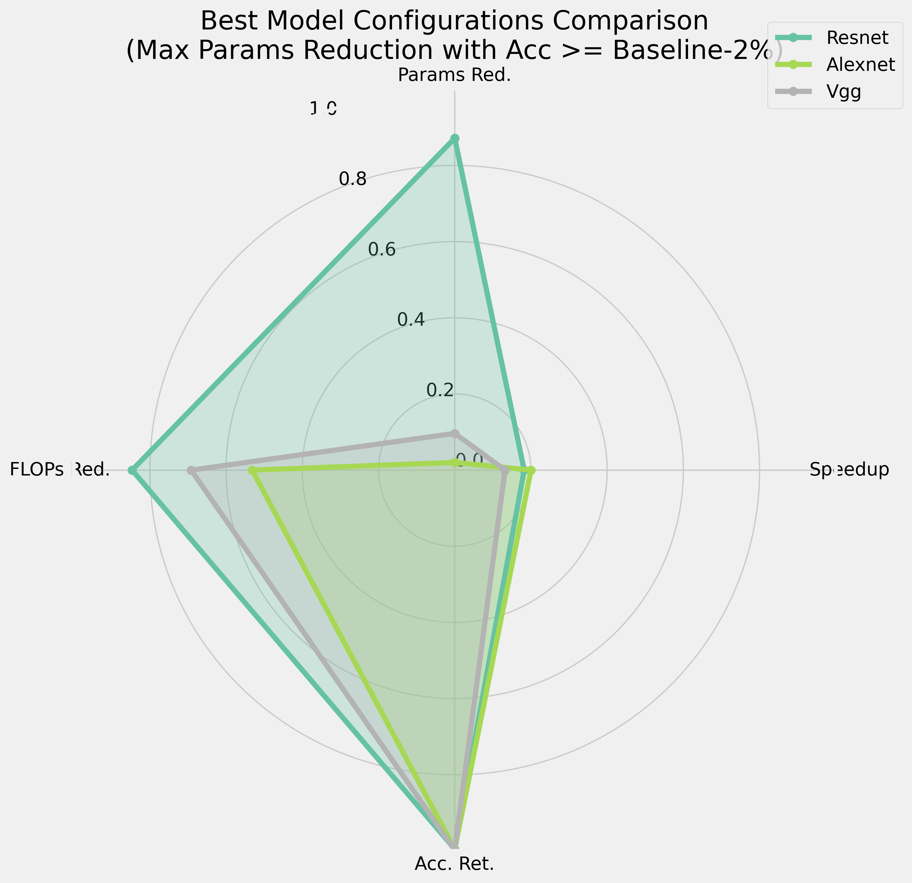

# CNN Compression using Hierarchical Tucker Decomposition (HTD)

This repository contains experiments on compressing CNNs using Hierarchical Tucker Decomposition (HTD). The experiments focus on applying HTD to fintuned AlexNet, VGG16, and ResNet18 models. Finetune code is available in finetuned -models are too large for github to accept. 

## Overview

The primary goal is to explore the trade-offs between model compression (reduction in parameters and FLOPs) and performance metrics (accuracy) when applying HTD to different CNN architectures.

Non Uniform rank selections for Conv2D layers outperforms unifrom low rank approximation througout the layers. Challenge is rank selections. 

Probabilistic methods like VBMF and Numerical methods like Singular Value Energy based threshholding perform well, but not as optimal as search and require many epochs of finetune. 

Here, we exploit the rank search space guided by a policy pdf approximated using the heuristics of layer sensitivity to decomposition and conv2d layer size. Outperfoms all methods, using only ~100 searches with <=3 epoch of finetune.  

## Results

### Performance Comparison

Compressino results are shown in the table for the whole model to emphasize that not all CNNs are created equal. Low rank approximation is worth it best for architectures with lots of conv layers, and deep channels. 

Also to note that a ~10% reduction in conv2D params can carry significant flops reduction. Which is to be expected as convolution is O(C_in * C_out * H_out * W_out * H_f * W_f) vs a linaer O(N_in * N_out) of Fully connected layers 
```
+---------+------------------+-------------+------------+----------+---------+-------------+---------------+------------+
|  Model  |    Criterion     | Params Red. | FLOPs Red. | Accuracy | Speedup | Parameters  |     FLOPs     | Comp. Rate |
+---------+------------------+-------------+------------+----------+---------+-------------+---------------+------------+
| Resnet  | Best Params Red. |   87.15%    |   84.67%   |  0.991   |  0.36x  |  1,436,382  |  279,777,098  |    7.78    |
| Resnet  | Best FLOPs Red.  |   87.15%    |   84.67%   |  0.991   |  0.36x  |  1,436,382  |  279,777,098  |    7.78    |
| Resnet  |   Best Speedup   |   28.71%    |   29.25%   |  0.994   |  0.89x  |  7,971,641  | 1,291,058,698 |    1.40    |
| Alexnet | Best Params Red. |    2.01%    |   53.17%   |  0.988   |  0.55x  | 55,898,473  |  333,623,360  |    1.02    |
| Alexnet | Best FLOPs Red.  |    2.01%    |   53.17%   |  0.988   |  0.55x  | 55,898,473  |  333,623,360  |    1.02    |
| Alexnet |   Best Speedup   |    2.01%    |   53.17%   |  0.988   |  0.55x  | 55,898,473  |  333,623,360  |    1.02    |
|   Vgg   | Best Params Red. |    9.64%    |   69.17%   |  0.993   |  0.26x  | 121,349,877 | 4,783,858,698 |    1.11    |
|   Vgg   | Best FLOPs Red.  |    9.59%    |   69.63%   |  0.993   |  0.21x  | 121,420,990 | 4,712,633,866 |    1.11    |
|   Vgg   |   Best Speedup   |    9.48%    |   68.42%   |  0.993   |  0.32x  | 121,565,134 | 4,900,492,810 |    1.10    |
+---------+------------------+-------------+------------+----------+---------+-------------+---------------+------------+
```

### Model Comparison Visualization

Important to notice that reductions in memory and flops cost does not equate an equal or even drop in inference time. Inference optimizations should be codesigned with hardware in mind. 



## Repository Structure

*   **.ipynb Notebooks:** (`htd-alexnet-res.ipynb`, `htd-vgg-res.ipynb`, `htd-resnet-res.ipynb`)
    *   Each notebook performs the HTD experiment for a specific model (AlexNet, VGG16, ResNet18).
    *   They load a pre-trained model, identify convolutional layers, generate HTD configurations, apply compression, optionally fine-tune the compressed model, evaluate performance, and log results.
*   **`common/`:** hwlper functions to perform and evaluate low rank approximation while search
*   **`finetuned/`:** finetuning code for Alexnet, resnet18 and vgg16
*   **`jsonify_logs.py`:** A script to convert experiment log files into JSON format.
*   **`analyze_results.py`:** A script to analyze the logged results from the experiments
*   **`logs/`:** (Not included in repo, but generated by notebooks) Directory where experiment logs are saved.


## Fine-tuning

The experiment notebooks include an option (`FINETUNE = True`) to perform a brief fine-tuning step (e.g., 3 epochs) on the compressed model. This helps recover some accuracy potentially lost during the compression process. 
